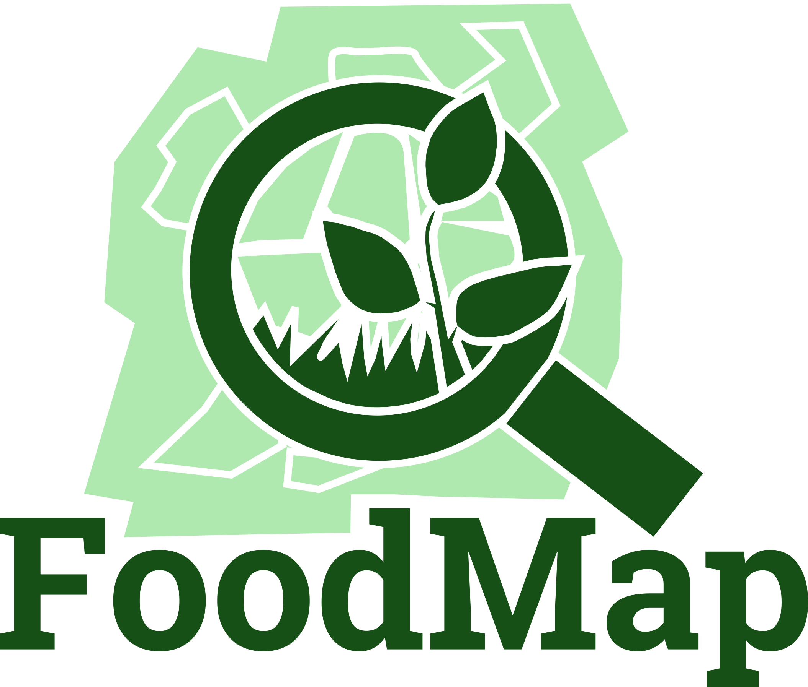

<html>
  <head>
    <title>Center an Image using text align center</title>
    
  </head>
  <body>
    
 <!-- Block parent element -->
      
    

  </body>
</html>

#### Quer conhecer o projeto FoodMap? Assista nosso Pitch
<iframe width="560" height="315" src="https://www.youtube.com/watch?v=9Hh9YAS3nlI" frameborder="0" allow="accelerometer; autoplay; clipboard-write; encrypted-media; gyroscope; picture-in-picture" allowfullscreen></iframe>

### Resumo
O projeto FoodMap utiliza diferentes bases de dados para caracterizar o cenário de produção agrícola no mundo, a fim de propor uma solução para a escassez de alimentos. Identifica áreas antropizadas no cenário de produção atual, cria um cenário ideal com base em critérios agronômicos e separa os locais para otimização da produção, definindo a adequação para uso com culturas perenes, anuais ou pastagens. A diferença é mapear o uso da terra, destacando as áreas não utilizados no planeta, para propor o uso produtivo sem aumentar o desmatamento e as queimadas, uma vez que o uso de áreas antropizadas promoverá uma produção eficiente e sustentável para a geração atual e futura.

### Para mais informações:
e-mail: foodmap.grees@gmail.com 
[Página do projeto no Nasa Space Apps](https://2020.spaceappschallenge.org/challenges/sustain/sustaining-our-planet-future-generations/teams/grees-1/project)
[Repositório:](https://github.com/foodmap-grees)

<!--
**foodmap-grees/foodmap-grees** is a ✨ _special_ ✨ repository because its `README.md` (this file) appears on your GitHub profile.

Here are some ideas to get you started:

- 🔭 I’m currently working on ...
- 🌱 I’m currently learning ...
- 👯 I’m looking to collaborate on ...
- 🤔 I’m looking for help with ...
- 💬 Ask me about ...
- 📫 How to reach me: ...
- 😄 Pronouns: ...
- ⚡ Fun fact: ...
-->
